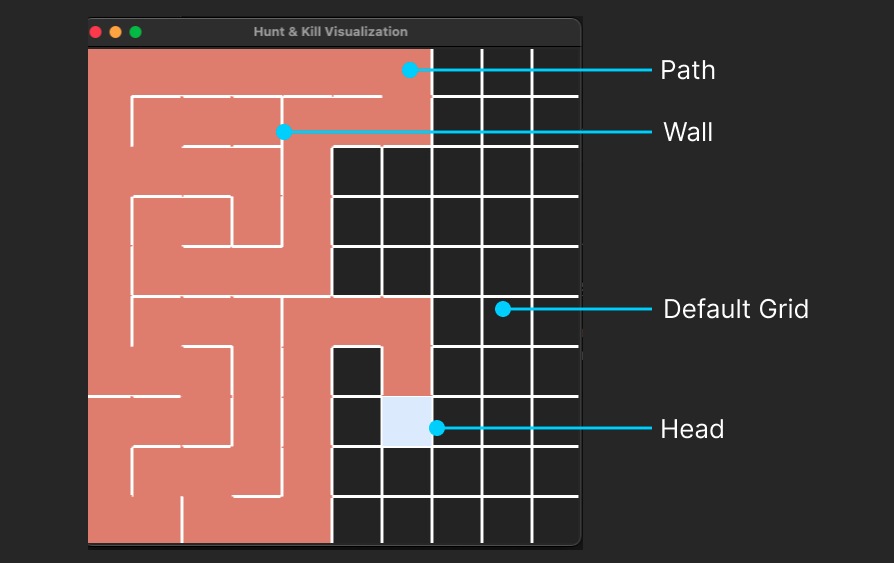

# Visualization Documentation
Last edit: Aug 2, 2023

## Table of Content
- Part 1 - General Program Structure
- Part 2 - Visualization Logics & Functions

## Part 1 - General Program Structure

### Overview
The whole program contains function-based Python files, except the `cell.py`.

`cell.py` is the the Class representing Cell objects used in the visualization. Cell objects are instantiated when the main grid of maze is initialized. And manipulating some of its fields during the visualization process.

### Seperated Algorithm Files and the Visualizations
The main algorithm files are better be seperated, except the parts that involve visualizations, like the rendering sequence based on specific algorithm features. 

> For instance, the hunt-and-kill algorithm finds a unvisited but adjacent cell to start when it hits a dead-end. The sequence of rendering these steps are included in the `maze_generation_algorithms_visualization.py`. However, the main logic of the algorithm, like how it chooses the running directions and how to find the next start point should be included in a seperated Python file, in this example, they are included in `hunt_and_kill_util.py`.

## Part 2 - Visualization Logics & Functions
The main challenge to visualize maze generations are rendering walls during the algorithm running. To solve it, we treat every cell as a tile instead of a dot.

### Naming of Components

### Render the Head
For better visualization, we can highlight the head of a path when it's generating. To do so, simply **call the method in *Cell*** `cell_name.draw_current_status(canvas, tile_size)`. Call this method only for the head.

### Render the Path
When the head moves to a new cell, the cell that just visited becomes part of the main maze. Now we need to render the visited path as part of the Path. To do so, **call the method in *Cell***, `cell_name.draw_path(canvas, tile_size)`.

### Draw Cell Walls
Considering each cell as a tile but not a dot is the first intuition for this visualization. And each tile has 4 walls `Top, Bottom, Left, Right`. 

To render walls of a cell, **call the method in *Cell***, `cell_name.draw_walls(canvas, tile_size)`. The method draws walls depending on their status. The wall rendering won't update automatically when you remove a wall; Thus, you would always want to draw walls again after removing or adding walls to a cell.

### Remove Walls
When the head moving from current cell to the next cell, we would like to remove the wall between these two cells, so that we can create a maze properly with walls. To do so, simply **call the function in the *visualization*** `remove_walls(current_cell, next_move)`. Don't forget to re-render walls for both cells `current_cell.draw_walls(canvas, tile_size)` and `next_move.draw_walls(canvas, tile_size)`.

### About the Last Cell
Depending on your visualization sequence, you may or may not need to draw path and walls after running the main loop of your algorithm. If applicable, call the two methods in the Cell to render the path and walls for the last cell. `current_cell.draw_path(canvas, tile_size)`, `current_cell.draw_walls(canvas, tile_size)`.

